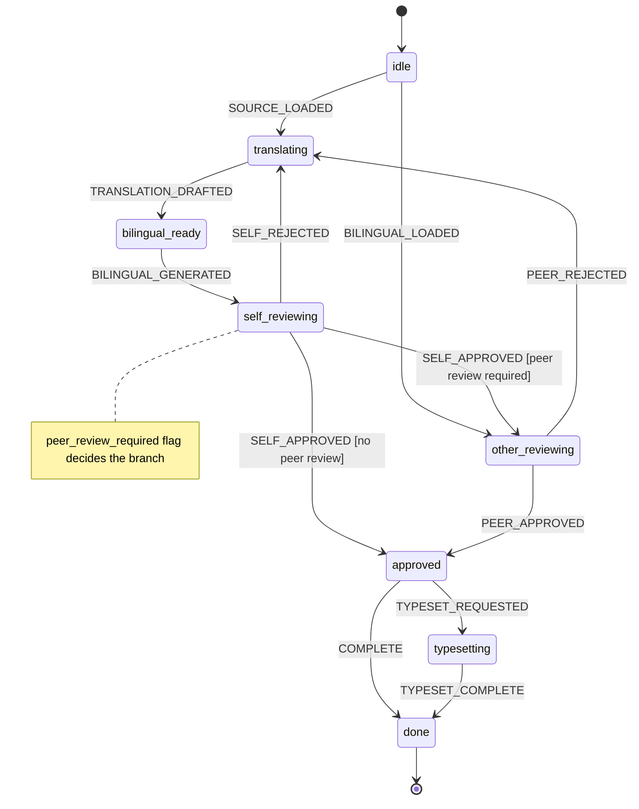

# MPI Project Conventions

## Skills

Skills in `skills/`.

Available: `translation`, `terms-search`, `self-review`, `other-review`, `chinese-text-normalize`, `pptx-translate`, `pdf-to-docx-conversion`.

## Terms Database

See `terms-search` skill. Quick reference:
- CLI: `terms-search/search.py <query> [limit]`
- Module: `from search import search; search("空性", limit=5, src="DoT定稿")`
- Priority: DoT定稿 > 内部特色词 > 佛教术语 > 经论名

## Directory Structure

```
translate-files/<topic>/<article>/
  source.dj      — Chinese original
  target.dj      — English translation (match source line count)
  bilingual.dj   — interleaved (source line, blank, target line, blank)
```

Put `.docx` output in `/tmp/`. Don't commit binaries.

---

## Translation State Machine

All translation work follows this deterministic workflow. Non-deterministic LLM work (drafting, reviewing) happens at the edges; the states and transitions are fixed.



States:

| State | Meaning | Output artifact |
|---|---|---|
| `idle` | Waiting for source or an existing bilingual file. | — |
| `translating` | Agent loads `translation` + `terms-search` skills and drafts `target.dj`. | `target.dj` |
| `bilingual_ready` | `bilingual.dj` generated from `source.dj` + `target.dj`. | `bilingual.dj` |
| `self_reviewing` | Three-pass review: terminology → mechanical → flow. | `commented.dj`, `translation-findings.dj` |
| `other_reviewing` | Peer review of someone else's translation. | `review-comments.dj` |
| `approved` | Translation accepted. May typeset or finish. | — |
| `typesetting` | Producing PDF/DOCX from approved bilingual content. | `.pdf` / `.docx` |
| `done` | Complete. | — |

## Workflow A: Translation（翻译）

Translate Chinese source into English. The agent IS the model — no external APIs. This workflow covers the state machine path `idle` → `translating` → `bilingual_ready` → `self_reviewing`.

### Input

Source text in `.dj` or `.docx` (Chinese only).

### Deliverables

- `source.dj` — extracted/cleaned Chinese
- `target.dj` — English translation, line count matches source
- `bilingual.dj` — interleaved (source line, target line adjacent, blank between pairs)
- `edit-suggestions.dj` — terminology/consistency issues flagged for review

### Rules

1. Load `translation` and `terms-search` skills before starting.
2. Search terms DB for key Buddhist terms.
3. TOC: plain bullet lists, no link targets, no page numbers.
4. Djot formatting:
   - Emphasis: `*text*` (single asterisks). Never `**` (Markdown bold).
   - Comments: ``
5. Preserve source formatting — don't add/remove emphasis.
6. Translate in-response — never call external translation APIs.

### Review

After translating, run `self-review` skill to check:
- Terminology consistency against terms DB
- Grammar, fluency, calques
- Missing content (mid-paragraph truncation)
- Inconsistency (same term translated differently)

---

## Workflow B: Proofread / Review（校对/审阅）

Two distinct sub-workflows depending on WHO did the translation. Both follow the review portion of the translation state machine (`self_reviewing` and `other_reviewing`).

### B1: Self-Review（自审）

You translated it. You own the English. Load `self-review` skill.

1. Extract `bilingual.dj` — never edit
2. `cp bilingual.dj commented.dj`
3. Apply inline fixes + `` annotations
4. Three-pass review: terminology → mechanical → flow
5. Can edit freely with `patch`

### B2: Other-Review（审他稿）

Someone else translated it (volunteer, etc.). Load `other-review` +
`self-review` skills.

1. Extract `bilingual.dj` — never edit
2. Review — do NOT edit bilingual.dj or create commented.dj
3. Write `review-comments.dj` with exact quoted text + suggestions
4. Follow deliberation protocol: 随喜 first, questions not commands
5. Address translator by name

---

## Djot

- Comments: ``
- Emphasis: `*text*` (single asterisks)
- Dashes in English: `---` em, `--` en. Pandoc converts in docx output.
- Preserve source formatting — don't add/remove emphasis

When editing `.dj` files, use `patch` (mode='replace') — not regex-based
string replacement in `execute_code`. `patch` is safer, surfaces conflicts,
and produces a diff you can review.

## Typst Bilingual Template

For producing PDFs from bilingual Chinese-English articles:

- Template: `translate-files/lib/mpi-bilingual-template.typ`
- Example host: `translate-files/从物品整理到心灵整理/mindful-organizing.typ`
- Design notes: `references/typst-template-design.md`
- Produce rendered PDF files in: /tmp/

## Scripts

Utility scripts in `scripts/` (fish for CLI wrappers, Python for data processing).
Agents should write repetitive logic here and run via `terminal` rather than
regenerating the same Python in execute_code each turn.

- `scripts/docx2dj.fish <docx>` — pandoc .docx → .dj alongside the original
- `scripts/split-bilingual.fish <combined.dj>` — split into source.dj (CN) + target.dj (EN)
- `scripts/dj2docx.fish <target.dj>` — pandoc .dj → .docx in `/tmp/`
- `scripts/proofread-pdf.py <docx> <pdf>` — word-level diff between manuscript and typeset PDF
- `scripts/gen-bilingual.fish <dir>` — produce `bilingual.dj` from `source.dj` + `target.dj`
- `scripts/gen-bilingual-<name>-<hash>.py` — article-specific extraction from DOCX

Article-specific scripts (including Typst compile helpers) should be placed in
the article directory itself, named with a short hash: e.g.
`translate-files/<article>/compile-typst-<hash>.fish`.
